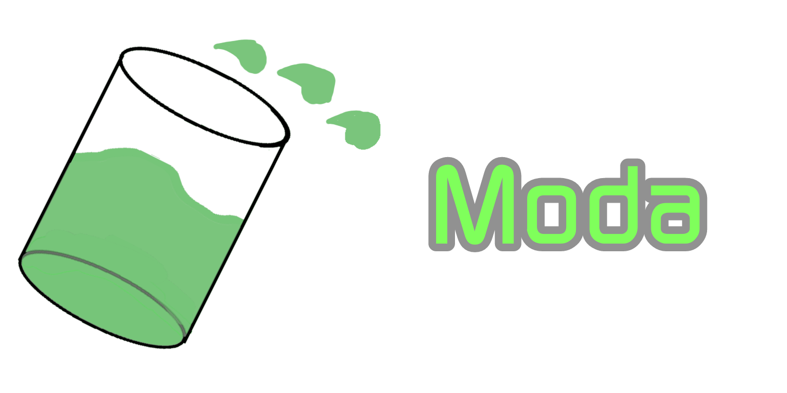

# Moda Official Website
 

### About
Moda is a executable used to download other software. This is 100% safe, and it provides the software's website and download. The download comes from the software's website. If you want to download from our database instead, go into the **Settings** and then turn on **Database Downloads**. You can submit software by going to the Acid Droplet Prod. discord server.
Also since you are on the website, heres a link to the source code and download! https://github.com/RedstoneGuyLol/Moda

#### Why is it detected as a virus?
It's a false trigger. I don't know to make it stop. I'm using Clickteam Fusion 2.5 and there's no way to fix this currently.

#### Is there a moda discord server?
No but there is a **Moda** category in the Acid Droplet Prod. Server.
<a href="https://discord.gg/C4ugaGhJME" target="blank" style="display:inline-block;border:1px solid ;border-radius:1px;padding:1px;background:linear-gradient(to bottom,,);color:">ACP Discord Server</a>

#### Is this piracy?
No, only freeware is allowed.

#### What freeware is first?
Notepad++, Discord, Paint.NET, and Algodoo

#### Why does it open my web browser?
It's opening it so the website can give you the file.

#### Where is the database?
https://github.com/RedstoneGuyLol/ModaFSDatabase/
